# CloudPayments модуль для Bitrix
Модуль позволит с легкостью добавить на ваш сайт оплату банковскими картами через платежный сервис [CloudPayments](https://cloudpayments.ru). 
Для корректной работы модуля необходима регистрация в сервисе.

### Возможности:  
	
* Одностадийная схема оплаты;
* Двухстадийная схема оплаты;
* Частичная оплата заказа;
* Изменение оплаченного заказа и прием доплаты согласно изменению;
* Отмена, подтверждение и возврат платежей из ЛК CMS;
* Поддержка онлайн-касс (ФЗ-54);
* Отправка чеков по email;
* Отправка чеков по SMS;
* Оплата через ссылку по счёту;
* Настройка НДС для службы доставки;

### Совместимость:
Подходящие редакции - «Малый бизнес», «Бизнес», «Корпоративный портал», «Энтерпрайз» версии 17 и выше;

### Установка через bitrix marketplace

Перейдите на страничку модуля в [marketplace](http://marketplace.1c-bitrix.ru/solutions/cloudpayments.cloudpayment/), нажмите "установить", укажите url сайта, вас перебросит на сайт.  
После чего нужно авторизоваться под админом, и скачать и установить модуль.

### Ручная установка

1.	Скопируйте архив с github. На ftp создаем папку  
`/bitrix/modules/cloudpayments.cloudpayment`
2.	В папку скопируйте все содержимое из архивной папки  
`\cloudpayments.cloudpayment\.last_version\`
3.	Итого в папке  
`/bitrix/modules/cloudpayments.cloudpayment` должны быть следующие файлы  
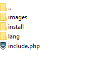
4.	Далее перейдите в раздел установки решений c marketplace в админке  
`/bitrix/admin/partner_modules.php?lang=ru`  
И нажмите напротив скопированного модуля - "установить".  
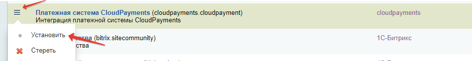
5. Чтобы модуль корректно работал, нужно внести ряд изменений в настройки модуля, а также настроить работу вебхуков в [личном кабинете](https://merchant.cloudpayments.ru/Account/Login).  
Настройки модуля и настройки вебхуков описаны ниже.

### Настройка модуля

1.	Сначала нужно создать новую платежную систему. Перейдите «Магазин» -> "Платежные системы"  
`/bitrix/admin/sale_pay_system.php?lang=ru`
2.	Нажмите кнопку «Добавить платежную систему»
3.	В качестве обработчика выбираем CloudPayments (cloudpayments).  
Далее введите:
* название;
* описание и прочие поля заполните по своему усмотрению. 
Нажмите «Применить», чтобы появились настройки самой платежной системы.
4.	Далее перейдите в раздел «Настройка обработчика ПС»  
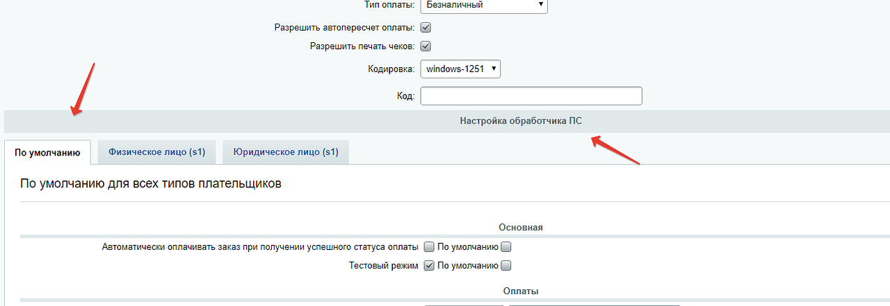
Заполните:
* «Public ID»;
* «Пароль для API», и выберите «Тип схемы проведения платежей».  
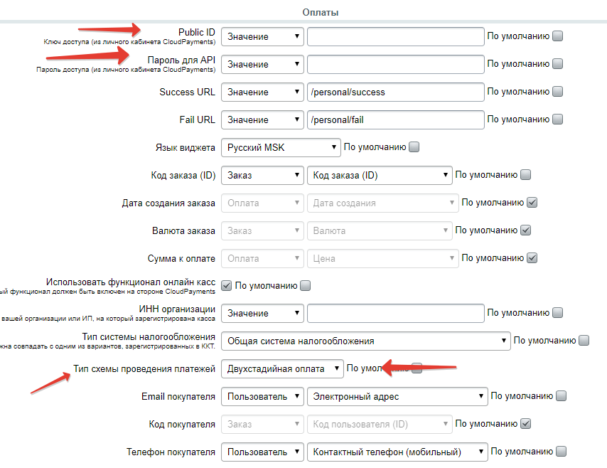  
Остальные параметры заполните на свое усмотрение. 

### Описание параметров модуля:
- **Success URL** - url на который будет переадресован пользователь после успешной оплаты заказа.
- **Fail URL** - url на который будет переадресован пользователь после неудачно оплаты заказа.
- **Язык виджета** - список доступных языков виджета оплаты заказа, который появляется, когда пользователь нажимает кнопку "оплатить".
- **Использовать функционал онлайн касс** - при использовании модуля онлайн касс, установив данный параметр, клиенту на почту будет приходить чек оплаты.
- **Тип схемы проведения платежей** - выбор схемы оплата платежной системы. Одностадийная оплата, или двухстадийная. При двухстадийной оплате требуется подтверждение оплаты заказа в административной части.
- **Статус возврата платежа** - в этом пункте выбирается какой статус заказа отвечает за возврат платежа. Т.е. выбрав указанный в этом пункте статус, в заказе, будет выполнена функция возврата платежа через API cloudpayments.
- **Статус авторизации платежа (двухстадийные платежи)** - в этом пункте выбирается какой статус заказа будет установлен после оплаты пользователем при двухстадийной схеме платежей.
- **Статус отмена авторизованного платежа (двухстадийные платежи)** - в этом пункте выбирается какой статус заказа нужно выбрать в заказе, чтобы произвести отмену оплаты при двухстадийной схеме платежей, в момент когда оплата не подтверждена, а только авторизована. Подробнее о двухстадийной схеме оплат, можно прочитать у нас на [сайте](https://cloudpayments.ru/wiki/integration/common/payments_schemes).
- **Выберите НДС на доставку, если необходимо** - в данном разделе можно установить размер ндс, с привязкой к добавленным на сайте службам доставки.

### Настройка вебхуков:

1) Авторизуйтесь в [личном кабинете](https://merchant.cloudpayments.ru/Account/Login); 
2) Перейдите в "Сайты"  
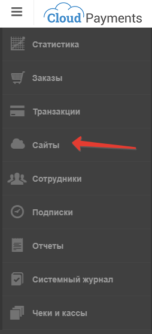
3) Добавьте свой сайт(если еще не добавили), и перейдите в настройки  
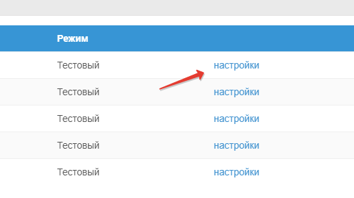
3) Далее, нажмите настройки  
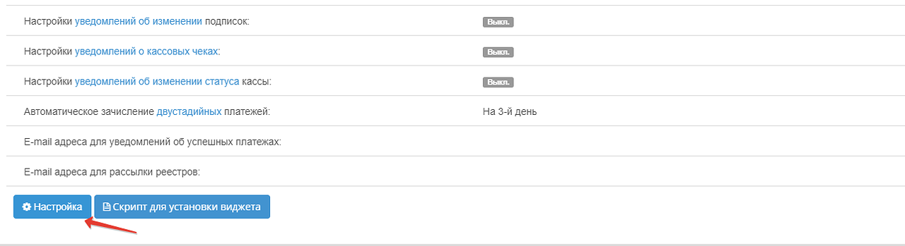

Напротив каждого хука копируйте линк ниже для соответствующего вебхука:

* **Check**  
`http://domain.ru/bitrix/tools/sale_ps_result.php?action=check`
* **Fail**  
`http://domain.ru/bitrix/tools/sale_ps_result.php?action=fail`
* **Pay**  
`http://domain.ru/bitrix/tools/sale_ps_result.php?action=pay`
* **Confirm**  
`http://domain.ru/bitrix/tools/sale_ps_result.php?action=confirm`
* **Refund**  
`http://domain.ru/bitrix/tools/sale_ps_result.php?action=refund`

Где **domain.ru** - адрес сайта.

### Двухстадийная оплата

Двухстадийная оплата подразумевает использование двух команд: отдельно на авторизацию, отдельно на списание. После успешной авторизации, сумма операции будет блокирована на счету держателя, то есть он не сможет ей воспользоваться. Далее у ТСП есть до 30 дней в зависимости от типа карты для подтверждения операции, после чего произойдет списание денег. Если операцию не подтвердить в течение этого времени — она будет автоматически отменена. Подтверждать можно как всю сумму авторизации, так и часть.

Как правило, двухстадийная схема используется для получения депозита с плательщика, например, в прокатных компаниях или отелях.

В зависимости от настройки, система может автоматически выполнять подтверждение двухстадийных платежей через указанное количество дней.

Для того чтобы включить двухстадийную оплату, нужно зайти в настройки модуля и в "Тип схемы проведения платежей" выбрать "Двухстадийная оплата". После чего платежная система будет работать по следующей схеме:
1) Клиент оплачивает на сайте заказ.
2) Заказ переходит в статус "Авторизован"
и в данный момент оплата считается "авторизованной" и требует подтверждения администратором в административной части.
3) Для этого переходим в редактирования соответствующего заказа. И меняем текущий статус заказа на новый. Выбранный в этом пункте настроек модуля.  
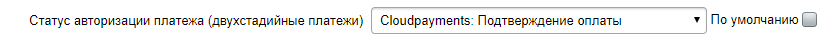
4) После того как будет получен ответ от cloudpayments (если вы настроили вебхук confirm), об успешном подтверждении, заказ будет считаться оплаченным. И статус заказа перейдет в "оплачен, формируется к отправке".

### Двухстадийная оплата - отмена авторизованного платежа

Чтобы отменить авторизованную, но не подтвержденную оплату. Нужно перейти в редактирование заказа и в статусе заказа выбрать статус выбранный в настройках модуля  
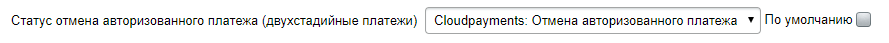  
После чего будет отправлен void запрос на отмену оплаты. 

### Возврат оплаченного заказа  

Чтобы вернуть оплаченный заказ. Нужно перейти в редактирование заказа и в статусе заказа выбрать выбранный статус в настройках модуля:  
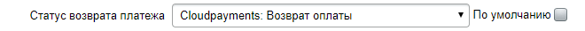  
После чего будет отправлен refund запрос на возврат оплаты. Также возврат оплаты будет произведена автоматически, если будет отменен или удален заказ в ЛК сайта или в редактирование заказа.  

**Если вы не можете ограничить доступ к управлению заказами, и при этом вам не нужна функция возврата из ЛК Битрикса, то можно ее отключить (во избежание ошибочных возвратов). Для этого откройте файл include.php и замените в строчке №268 url на local.domain.** 
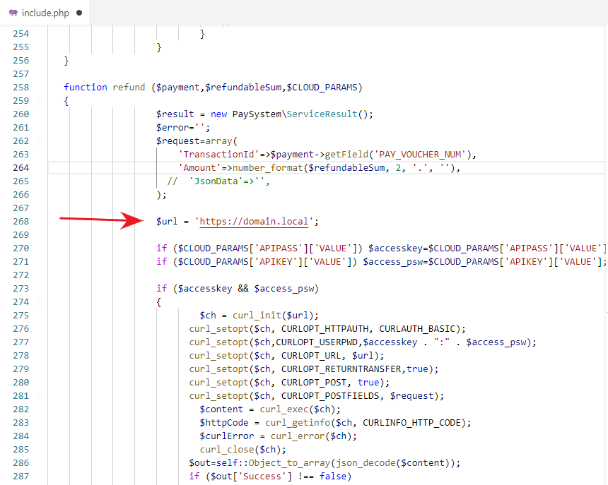

### Заказы в статусе "возврат"

Если заказ в статусе возврат, кнопки оплатить виджета не будет, а вместо нее будет выводиться фраза  
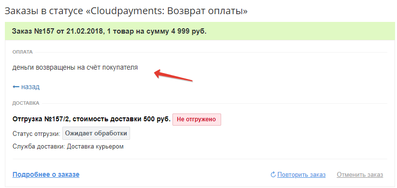  
Текст можно изменить тут:
`/bitrix/php_interface/include/sale_payment/cloudpayment/template/lang/ru/template.php`
В личном кабинете пользователя может выводиться кнопка "оплатить" компонента, но при нажатии кнопки будет выводиться фраза описанная выше. 
Кнопку оплаты битрикса можно удалить в шаблоне списка заказов
sale.personal.order.list в случае если используется стандартный компонент битрикса.

### Прочие настройки

При двухстадийной схеме оплаты, и использование дефолтного личного кабинета пользователя на сайте. Может возникнуть ситуация, что заказа оплачен пользователем (авторизована оплата), но не подтверждена администратором сайта. И фактически битрикс такой заказ считает неоплаченным, и выводит в личном кабинете кнопку оплаты. Пример:  
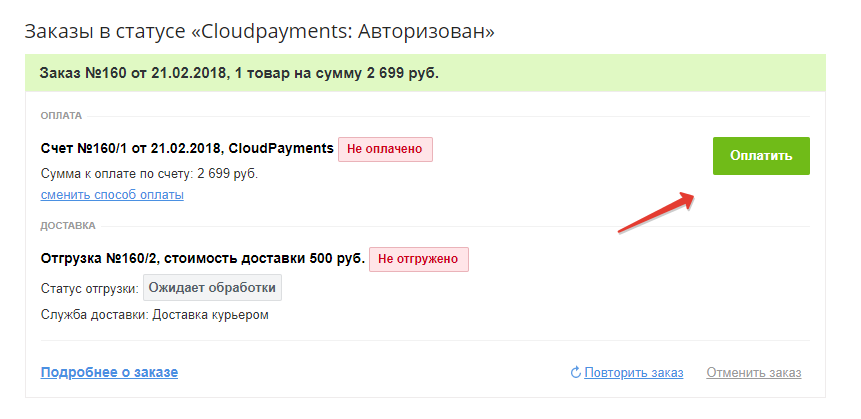
Виджет модуля Cloudpayments конечно такой заказа повторно оплатить не даст, и при нажатии оплаты. Выведет текст, что заказ уже оплачен и требует подтверждения:  
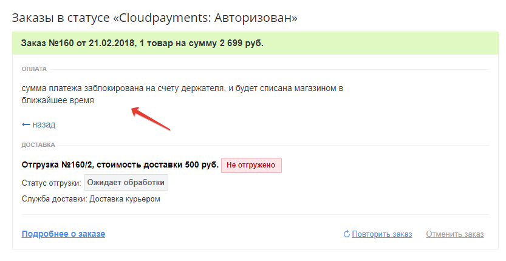
Данный текст можно поменять тут:  
`/bitrix/php_interface/include/sale_payment/cloudpayment/template/lang/ru/template.php`

Кнопку оплаты битрикса можно удалить в шаблоне списка заказов
sale.personal.order.list в случае если используется стандартный компонент битрикса.

### Changelog

**1.0.10**
- Поддержка PHP 8
- Обновлена локализация виджета
- Добавлены дополнительные параметры фискализации - [подробнее](https://static.cloudpayments.ru/docs/uz/CP_1C-Bitrix_UZ.pdf)